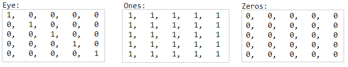
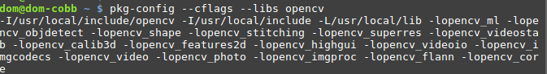

## El objeto cv::Mat
La clase cv::Mat es un tipo de dato definido en OpenCV para el almacenamiento de
imágenes y posterior tratamiento, a continuación discribiremos los aspectos más relevates referidos a esta clase.

### Métodos
*	***cv::Mat::Mat(int rows, int cols, int type): ***
Constructor de un objeto de tipo cv::Mat, allí se deben definir 3 valores fundamentales, la cantidad de files de la matriz (imagen) y la cantidad de columnas de la misma. El tercer parámetro indica dos cosas, el tipo de dato y la cantidad de canales, ¿como lo hace?, opencv define algunas macros esenciales, en este caso particular es útil unicamente ver su formato y como pueden ser utilizadas (más adelante iremos viendo otras macros imporantes):

  `CV_<bit depth>{U|S|F}C(<number of channels>)`

   Los valores son los siguientes:
   * bit_depth: Indica el número de bits que se utilizarán para almacenar la imagen, sus valores pueden ser: 8, 16, 32, etc*
   * En seguida se indica *U, S o F* que respectivamente hacen referencia a tipos de dato *Sin signo* (rango 0, 255), * Con signo* (rango -127, 128) y *Flotante* (Rango 0.000, 1.000).
   * Al final se indica el número de canales que se utilizarán, C3->3 canales, C1->1 canal, entre otros.

   Por ejemplo, para crear un objeto de tipo cv::Mat de 512x512 con valores entre 0 y 255, cuyos datos serán de tipo *entero 8 bits sin signo* (8U) y que manejará 3 canales (3C), la sintaxis adecuada es la siguiente:

   `cv::Mat imagen(512, 512, CV_8UC3);`
* ***Inicialización***: Podemos inicializar obejtos de tipo *cv::Mat* al igual que en Matlab, mediante el uso de las funciones *cv::Mat::zeros, cv::Mat::ones, cv::Mat::eye*. A las funciones anteriormente mencionadas también se les debe indicar la cantidad de filas, columnas y el tipo de dato, por ejemplo.

    `Mat E = Mat::eye(5, 5, CV_32F);`
    
    Obtendremos objetos tipo *cv::Mat* con los siguientes valores iniciales:
    
    


### Acceso a pixeles


### Propiedades
***.rows***: Este atributo contiene la cantidad de filas que posee la imagen.
***.cols***: Este atributo indica la cantidad de columnas de la imagen.

## Cargar y Guardar Imagenes
### Leer una imagen del disco
OpenCV dispone de la función *imread* que recibe dos parámetros, el primero corresponde al nombre de la imagen que se desea cargar y el segundo corresponde al modo con el cual se cargará la imagen, su valor de retorno es un objeto de tipo *cv::Mat*. La sintaxis de imread es la siguiente:

`imread("nombre_imagen.png", CV_LOAD_MODE);`

Donde `CV_LOAD_MODE` puede tomar los siguientes valores:
*	`CV_LOAD_IMAGE_UNCHANGED` (<0) carga la imagen 'como es' (incluyendo el canal alfa si existe)
*	`CV_LOAD_IMAGE_GRAYSCALE` (0)
*	`CV_LOAD_IMAGE_COLOR` (>0) Carga la imagen en formato BGR

Ejemplo para cargar la imagen *Lenna.png* en sus colores originales:

`cv::Mat image = imread("Lenna.png", CV_LOAD_IMAGE_COLOR);`

### Mostrar imagenes
Para mostrar imágenes, hacemos uso de las funciones `namedWindow` e `imshow`. Para usar la función `namedWindow` debemos indicar el nombre con el que queremos que aparezca la ventana y el segundo parámetro puede asumir los siguientes valores:
*	WINDOW_AUTOSIZE: El el único valor soportado si no se está haciendo uso del *backend* QT. En este caso la ventana asumirá el tamaño de la imagen que se desea mostrar y no se podrá modificar las dimensiones.
*	WINDOW_NORMAL: Con QT se puede hacer uso de esta opción para permitir la modificación dinámica del tamaño de la ventana (ya no será un tamaño fijo). Adicionalmente, haciendo uso del operador OR (|) se puede ndicar si se desea que la imagen mantenga su aspecto en cuanto a proporción cuando se modifique el tamaño de la ventana que la contiene con WINDOW_KEEPRATIO o no (WINDOW_FREERATIO).

Finalmente con la función *imshow("Nombre_Ventana", imagen)* se actualiza la imagen que contenga la ventana OpenCV.
Un ejemplo de todo lo anterior se muestra a continuación:

```cpp
Mat imagen = imread("Lenna.png", CV_LOAD_IMAGE_COLOR);
namedWindow("Display Window", WINDOW_AUTOSIZE);
imshow("Display Window", imagen);
```
**Nota**: Utilice la función *waitKey(tiempo_ms)* para deterner la ejecucíon del programa y esperar a que el usuario presiones una tecla y así evitar que el programa se termine rápidamente. El parámetro recibido por **waitKey** corresponde al tiempo en milisegundos que el programa esperará para que el usuario presione una tecla, si su valor en 0 entonces esperará indefinidamente.

### Guardar imagenes en el disco


## Compilación de Programas
Para trabajar de forma adecuada con *opencv* debemos incluir los archivos de cabecera teniendo en cuenta la siguiente forma:

`#include <opencv2/header_name.hpp>`

Por ejemplo, para compilar el siguiente código, escrito en un archivo que llamaremos *main.cpp*.
```cpp
#include <iostream>
#include <opencv2/core.hpp>
#include <opencv2/highgui.hpp>

using namespace cv;

int main( int argc, char** argv )
{
  Mat image;
  image = imread( argv[1], 1 );
  namedWindow( "Display Image", CV_WINDOW_AUTOSIZE );
  imshow( "Display Image", image );
  waitKey(0);
  return 0;
}
```
La compilación de dicho archivo se puede realizar de la siguiente manera:
```
g++ -ggdb main.cpp  `pkg-config --cflags --libs opencv` -o main
```

La función de la lína `pkg-config --cflags --libs opencv` es entregar las ubicaciones de los archivos de cabecera y los nombres de las bibliotecas que pueden ser utilizadas en nuestros programas.

